<!-- _class: title -->

# Getting the most out of shared<br>code in Kotlin Multiplatform

## Maciej Procyk

### Kotlin Multiplatform Tooling

## JetBrains


---

<!-- header: '' -->

# The background story

---
<!-- header: 'The idea' -->

* everyone needs to do the shopping
* but not everyone likes commercial solutions
* let's write a usable app for shopping with my family
* write code once, run everywhere
* deploy to the world

---

<!-- header: 'The result' -->

* a usable app published on Google Play and available as a web page
* a deployed app server with an independent database
* an app capable of full shopping list management

---

<!-- scoped style -->
<style scoped>
img {
  max-width: 100%;
}
</style>

<!-- header: 'The result' -->


---

<!-- header: '' -->

# The technical part

---

<!-- header: 'The goals' -->

* increase awareness of Kotlin Multiplatform (KMP)
* show how to start your journey with KMP
* share crucial and tricky parts of KMP development
* showcase a nice combination of KMP libraries as a generic development stack
* share a battle-tested reference of a multiplatform app

---

<!-- header: 'Why use Kotlin Multiplatform?' -->

* make your project easy to fix and improve
* it runs everywhere (where reasonable)
* integrates at various levels — you decide where
* lets you use platform-native APIs
* you end up with platform-native binaries

---

<!-- header: 'Kotlin Multiplatform — the general idea' -->

* you define which targets you want your app to compile for
* look for KMP libraries you need that expose functionality in the `common` source set
* use `expect` and `actual` keywords to define platform-specific code
* build the app for each of the targets separately

---

<!-- header: 'Where to start?' -->

* keep the [official KMP docs](https://www.jetbrains.com/help/kotlin-multiplatform-dev/quickstart.html) open
* check out the nice collection of libraries at [klibs.io](https://klibs.io)
* project creation is as simple as going to [kmp.new](https://kmp.new)
* see `README.md` for first-time instructions; the IDE will help you a lot
  * the story begins with a functional Compose Multiplatform (CMP) app
  * which you can easily iterate on
  * where the desktop JVM target is your friend, since you get Compose Hot Reload (CHR)

---

<!-- header: 'How you can start — in‑IDE demo' -->

1) Use the latest IntelliJ IDEA or Android Studio and install the [Kotlin Multiplatform](https://plugins.jetbrains.com/plugin/14936-kotlin-multiplatform/versions/stable) plugin
2) Go to the `Kotlin Multiplatform` wizard to create a new project
3) Select your targets and start coding!
4) Optional: Try live coding with CHR

---

<!-- header: '' -->

# Insights and tips

---

<!-- header: '`Bring!`&nbsp;project structure' -->

<div class="columns">
<div class="center">

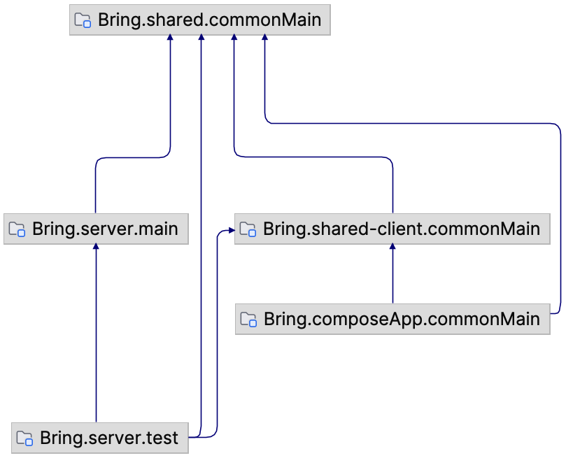

</div>
<div class="center">

* `shared` module contains data models, RPC APIs, common logic, utilities, etc.
* `shared-client` module contains the client (used by `composeApp` and `server` integration tests)
* `composeApp` module contains the client app
* `server` module contains the server-side implementation

</div>
</div>

---

<!-- header: '`Bring!`&nbsp;project structure' -->

<div class="columns">
<div class="center">

```shell
bring
├─ composeApp
│  └─ src
│     ├─ androidMain
│     ├─ commonMain
│     ├─ iosMain
│     ├─ jvmMain
│     └─ webMain
├─ server
│  └─ src
│     ├─ main
│     └─ test
├─ shared
│  └─ src
│     └─ commonMain
└─ shared-client
   └─ src
      ├─ commonMain
      └─ ...
```

</div>
<div class="center">

- `shared` module contains data models, RPC APIs, common logic, utilities, etc.
- `shared-client` module contains the client (used by `composeApp` and `server` integration tests)
- `composeApp` module contains the client app
- `server` module contains the server-side implementation

</div>
</div>

---

<!-- header: 'Gradle configuration files —&nbsp;`shared`&nbsp;targets' -->

<div class="columns">
<div class="center">

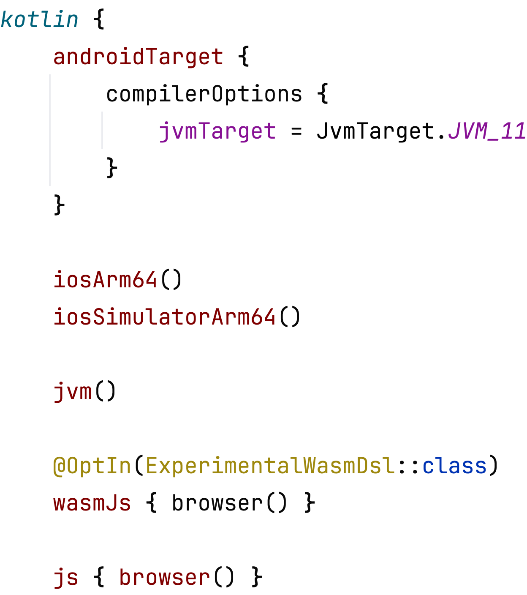

</div>
<div>

* `kotlin { ... }` block defines targets in `build.gradle.kts`
* define multiple targets in a single module
* configure each target separately with IDE completion inside the `{ ... }` block
* add them step by step, each time trying to build the project for that specific target

</div>
</div>

---

<!-- header: 'Gradle configuration files —&nbsp;`composeApp`&nbsp;targets' -->

<div class="columns">
<div class="center">

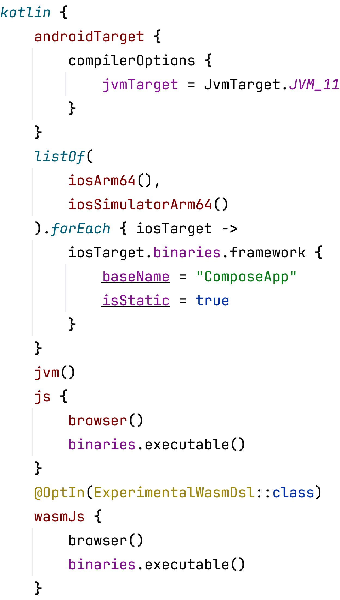

</div>
<div>

* explicitly define final build executables
* JVM is handled by `compose.desktop { ... }`, while Android is handled via `android { ... }` and the `AndroidManifest.xml`
* the defaults for JVM, JS, and WASM are `main()` entry points
* use the `webMain` common source set so both web targets can be built from a single source set for simplicity (search in [docs](https://www.jetbrains.com/help/kotlin-multiplatform-dev/compose-multiplatform-create-first-app.html#compatibility-mode-for-web-targets) for Gradle task `composeCompatibilityBrowserDistribution`)

</div>
</div>

---

<!-- header: 'Gradle configuration files —&nbsp;`shared`&nbsp;source sets and dependencies' -->

<div class="columns">
<div class="center">

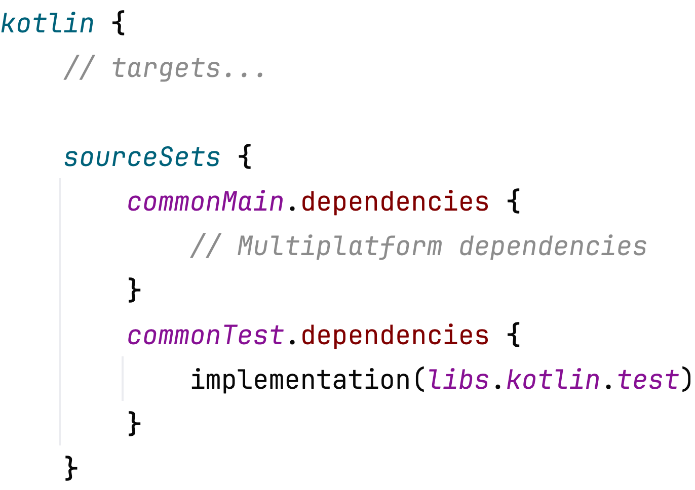

</div>
<div>

* source sets define the set of files compiled against a specific group of targets
* some predefined ones (`commonMain`, `commonTest`, `jvmMain`, `jvmTest`, ...)
* you can define your own that combine some of them
* each source set is commonized to the APIs available on the targets it's used with

</div>
</div>

---

<!-- header: 'Gradle configuration files —&nbsp;`composeApp`&nbsp;source sets and dependencies' -->

<div class="columns">
<div class="center">

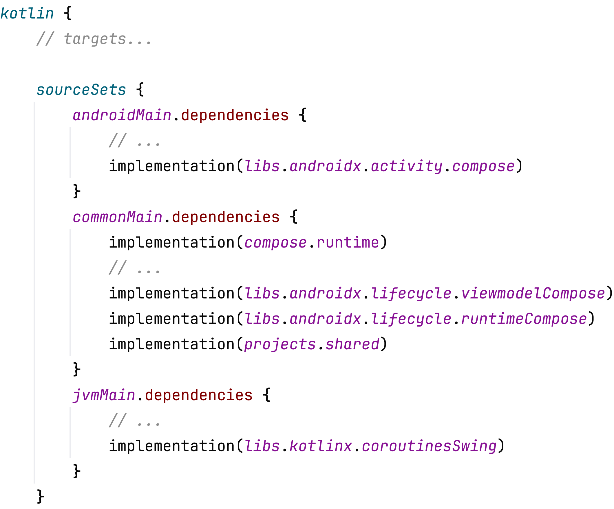

</div>
<div>

* target-specific source sets can have target-specific dependencies
* each is resolved in the relevant source set
* it's enough to depend on the `projects.shared` project to get its `commonMain` APIs

</div>
</div>

---

<!-- scoped style -->
<style scoped>
.columns {
    display: grid;
    grid-template-columns: 1fr 2fr;
    gap: 1rem;
}
</style>

<!-- header: 'Different behavior on each platform —&nbsp;`expect`/`actual`&nbsp;in action' -->

<div class="columns">
<div>
   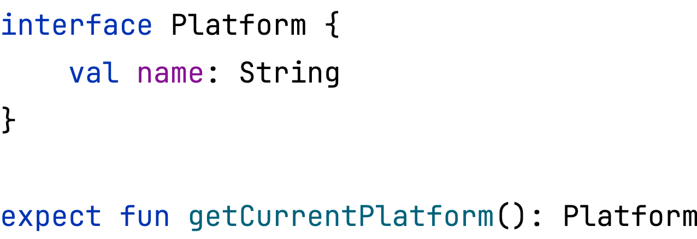
   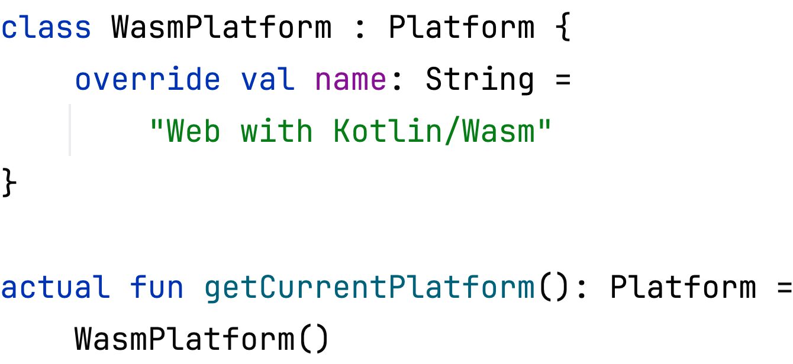
   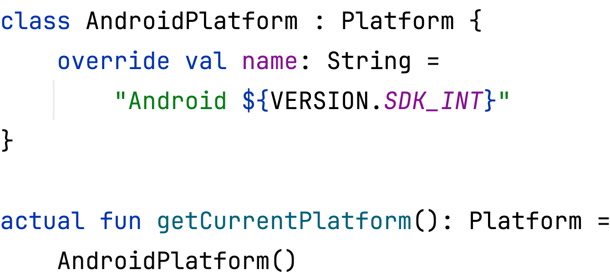
</div>
<div>

* common code with `expect`
* platform-specific code with platform-specific APIs
* WASM-specific behavior
* Android-specific behavior
* ...
* differences in behavior on each platform

</div>
</div>

---

<!-- scoped style -->
<style scoped>
.columns {
    grid-template-columns: 3fr 2fr;
}
.columns > .center {
    align-items: start;
}
</style>

<!-- header: 'Different APIs on each platform —&nbsp;`expect`/`actual`&nbsp;in action' -->

<div class="columns">
<div class="center">
   
   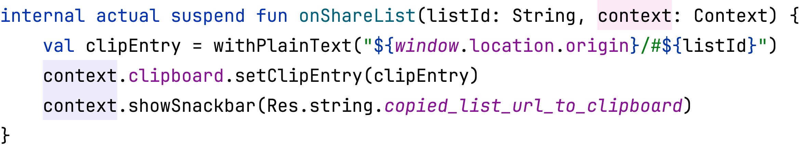
   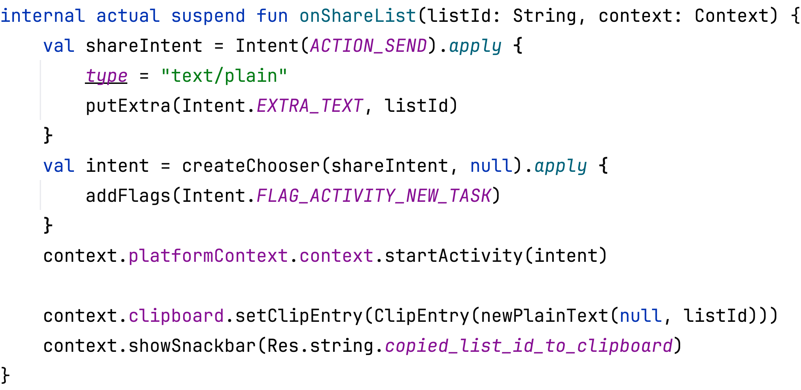
</div>
<div class="center">

* common code with `expect`
* platform-specific code with platform-specific APIs
* web implementation using a library-provided `ClipEntry` and a platform-specific API
* Android implementation configures a custom Intent to enable sharing the list

</div>
</div>

---

<!-- scoped style -->
<style scoped>
.columns {
    grid-template-columns: 4fr 5fr;
}
</style>

<!-- header: '`shared`&nbsp;part — data models, core logic, utilities' -->

<div class="columns">
<div class="center">

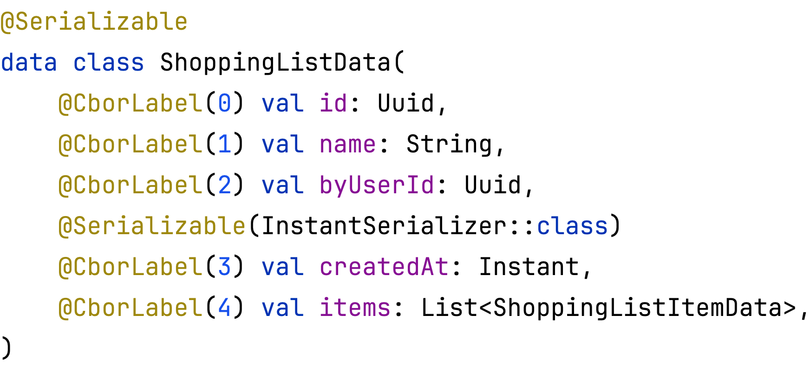

</div>
<div>

* located in the `shared` module
* available to the `server` and `composeApp` modules
* define the data models being transferred
* `kotlinx-serialization` is used to serialize/deserialize them
* supports many formats, including JSON, CBOR, Protobuf, etc.
* control how data is serialized/deserialized with custom serializers

</div>
</div>

---

<!-- scoped style -->
<style scoped>
.columns {
    grid-template-columns: 4fr 5fr;
}
</style>

<!-- header: '`shared`&nbsp;part — data models, core logic, utilities' -->

<div class="columns">
<div class="center">

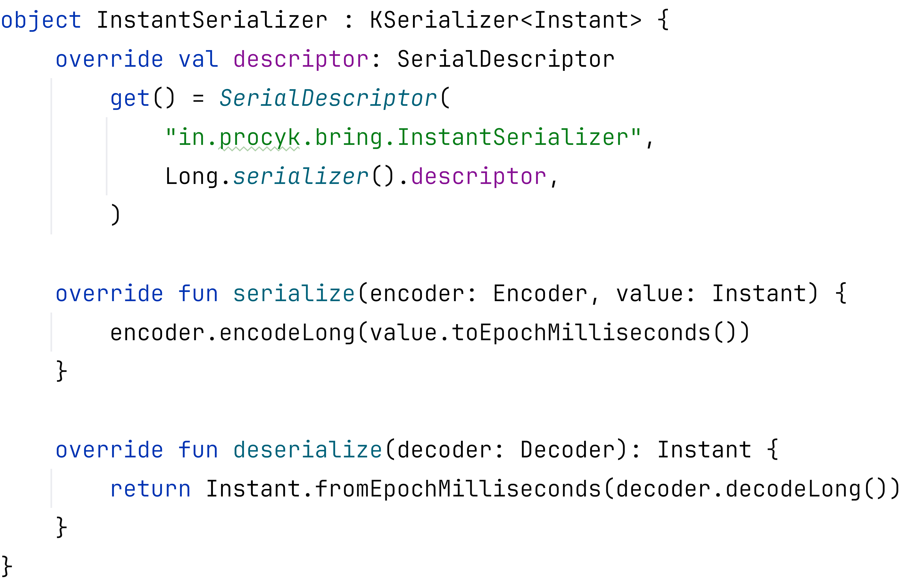

</div>
<div>

- located in the `shared` module
- available to the `server` and `composeApp` modules
- define the data models being transferred
- `kotlinx-serialization` is used to serialize/deserialize them
- supports many formats, including JSON, CBOR, Protobuf, etc.
- control how data is serialized/deserialized with custom serializers

</div>
</div>

---

<!-- header: '`shared`&nbsp;part — client/server communication' -->

<div class="columns">
<div class="center">

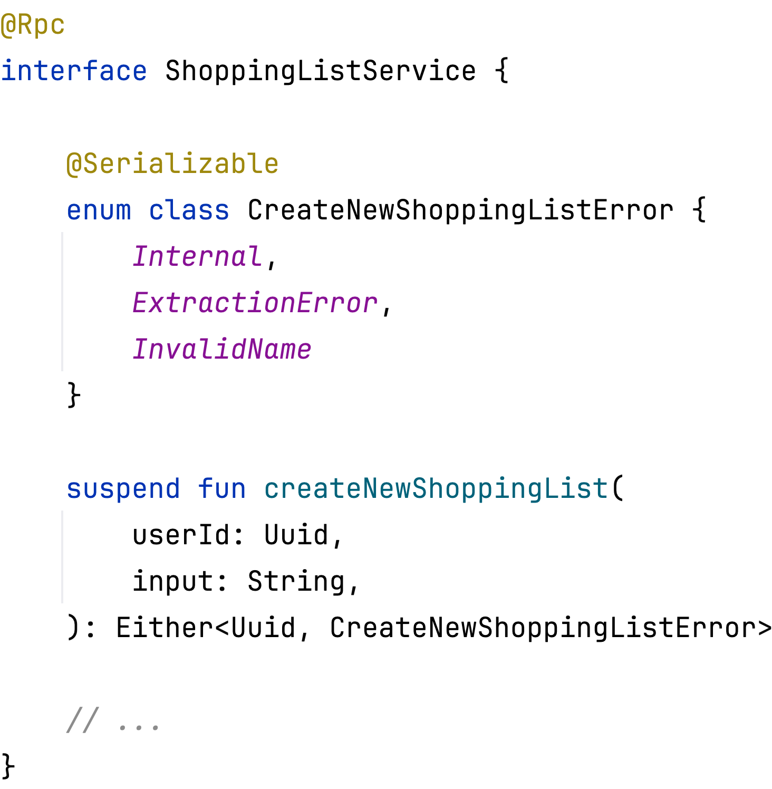

</div>
<div>

* `kotlinx-rpc` is an (experimental) high-level abstraction for communication
* allows customization of the actual transport layer
* define the API for the client and server
* implement the API on the server side as plain functions

</div>
</div>

---

<!-- scoped style -->
<style scoped>
.columns {
    grid-template-columns: 4fr 3fr;
}
</style>

<!-- header: '`server`&nbsp;part — client/server communication' -->

<div class="columns">
<div class="center">

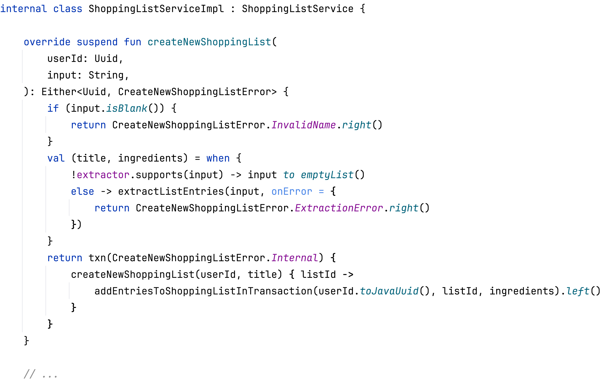

</div>
<div>

* simply override defined methods on the server side
* connections from clients are established automatically
* uses Ktor transports under the hood (WebSockets and HTTP), but gRPC is also supported
* each used type must be `@Serializable`
* to get continuous updates of `T` from the server, use `Flow<T>`

</div>
</div>

---

<!-- scoped style -->
<style scoped>
.columns {
    grid-template-columns: 3fr 2fr;
}
</style>

<!-- header: '`server`&nbsp;part — database access' -->

<div class="columns">
<div class="center">

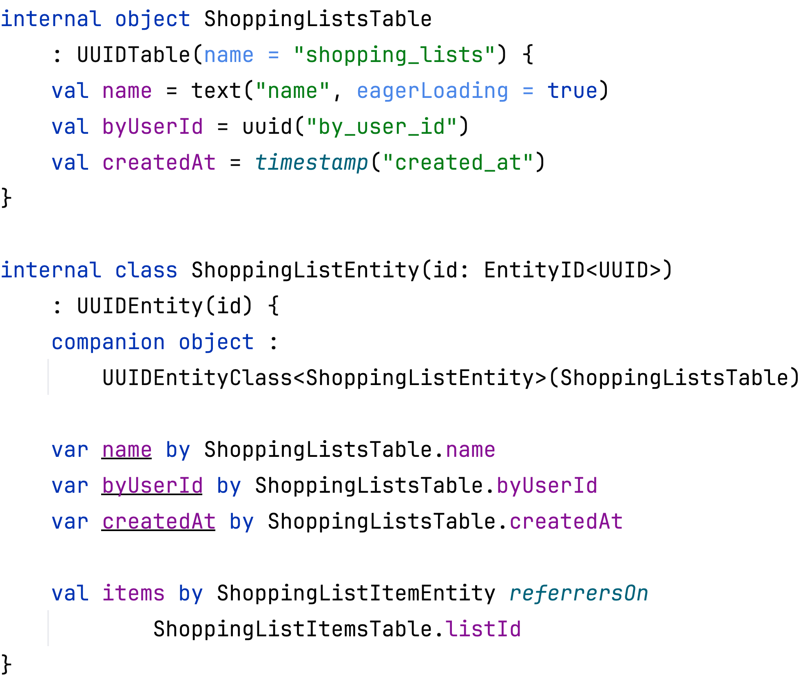

</div>
<div class="center">

* [Exposed](https://www.jetbrains.com/help/exposed/home.html) SQL library for database access
* lets you operate at various levels of abstraction:
  * DSL for typed SQL queries
  * DAO for ORM-like queries

</div>
</div>

---

<!-- scoped style -->
<style scoped>
.columns {
    grid-template-columns: 3fr 2fr;
}
</style>

<!-- header: '`server`&nbsp;part — database access' -->

<div class="columns">
<div class="center">

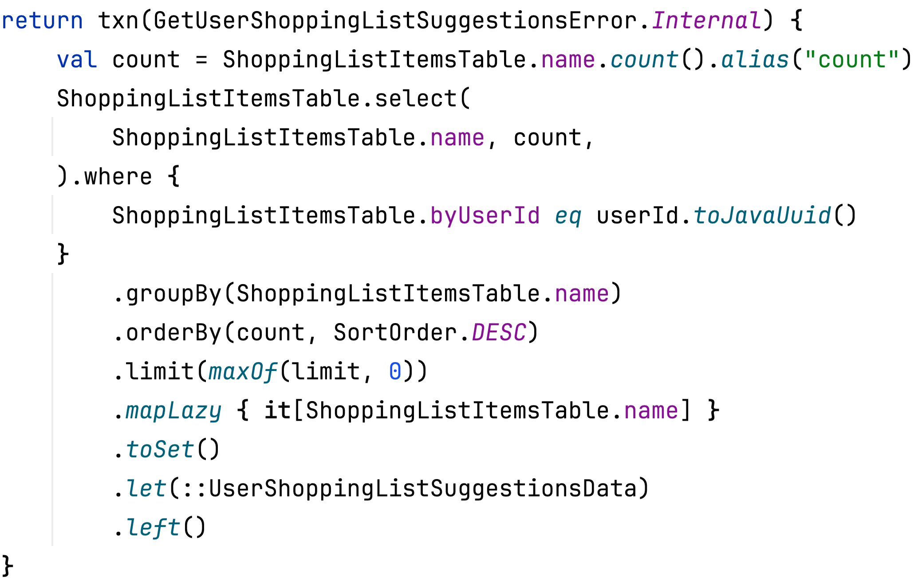

</div>
<div class="center">

- [Exposed](https://www.jetbrains.com/help/exposed/home.html) SQL library for database access
- lets you operate at various levels of abstraction:
  - DSL for typed SQL queries
  - DAO for ORM-like queries

</div>
</div>

---

<!-- scoped style -->
<style scoped>
.columns {
    grid-template-columns: 3fr 2fr;
}
</style>

<!-- header: '`server`&nbsp;part — database access' -->

<div class="columns">
<div class="center">

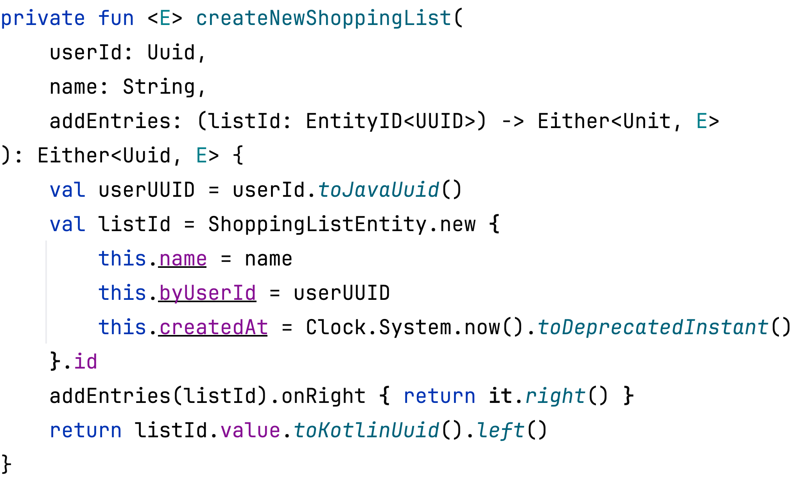

</div>
<div class="center">

- [Exposed](https://www.jetbrains.com/help/exposed/home.html) SQL library for database access
- lets you operate at various levels of abstraction:
  - DSL for typed SQL queries
  - DAO for ORM-like queries

</div>
</div>

---

<!-- scoped style -->
<style scoped>
.columns {
    height: 24em;
}
</style>

<!-- header: '`server`&nbsp;part — server implementation' -->

<div class="columns">
<div class="center">

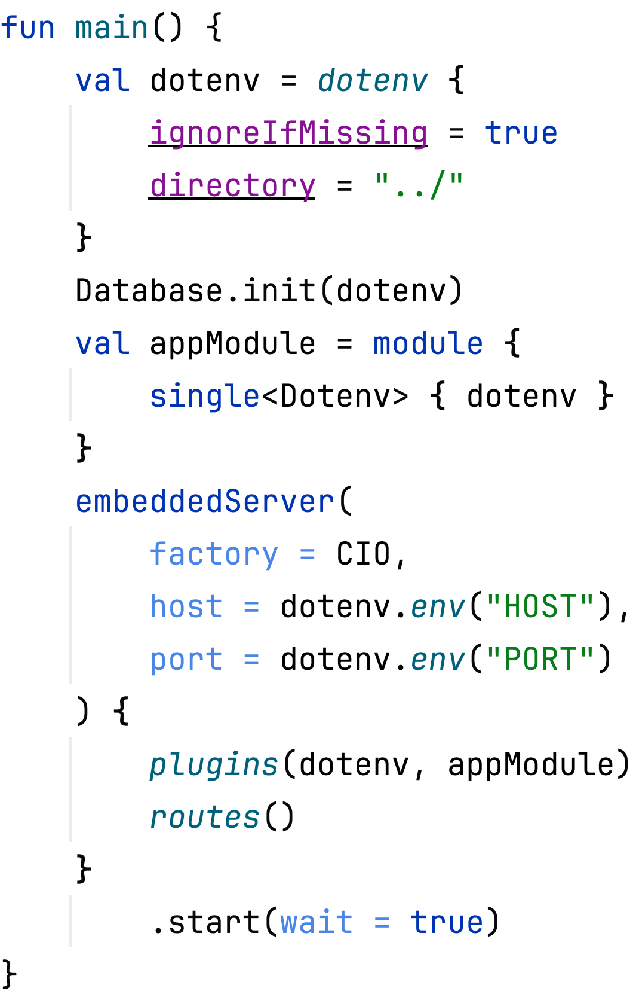

</div>
<div>

* [Ktor](https://ktor.io/docs/welcome.html) framework for building the server

</div>
</div>

---

<!-- scoped style -->
<style scoped>
.columns {
    height: 24em;
}
</style>

<!-- header: '`server`&nbsp;part — server implementation' -->

<div class="columns">
<div class="center">

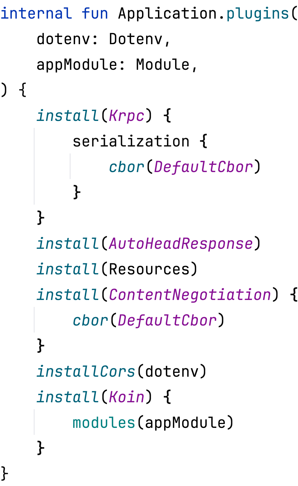

</div>
<div>

- [Ktor](https://ktor.io/docs/welcome.html) framework for building the server
- a huge collection of plugins
* nice integration with `kotlinx-rpc`

</div>
</div>

---

<!-- scoped style -->
<style scoped>
.columns {
    height: 24em;
}
</style>

<!-- header: '`server`&nbsp;part — server implementation' -->

<div class="columns">
<div class="center">

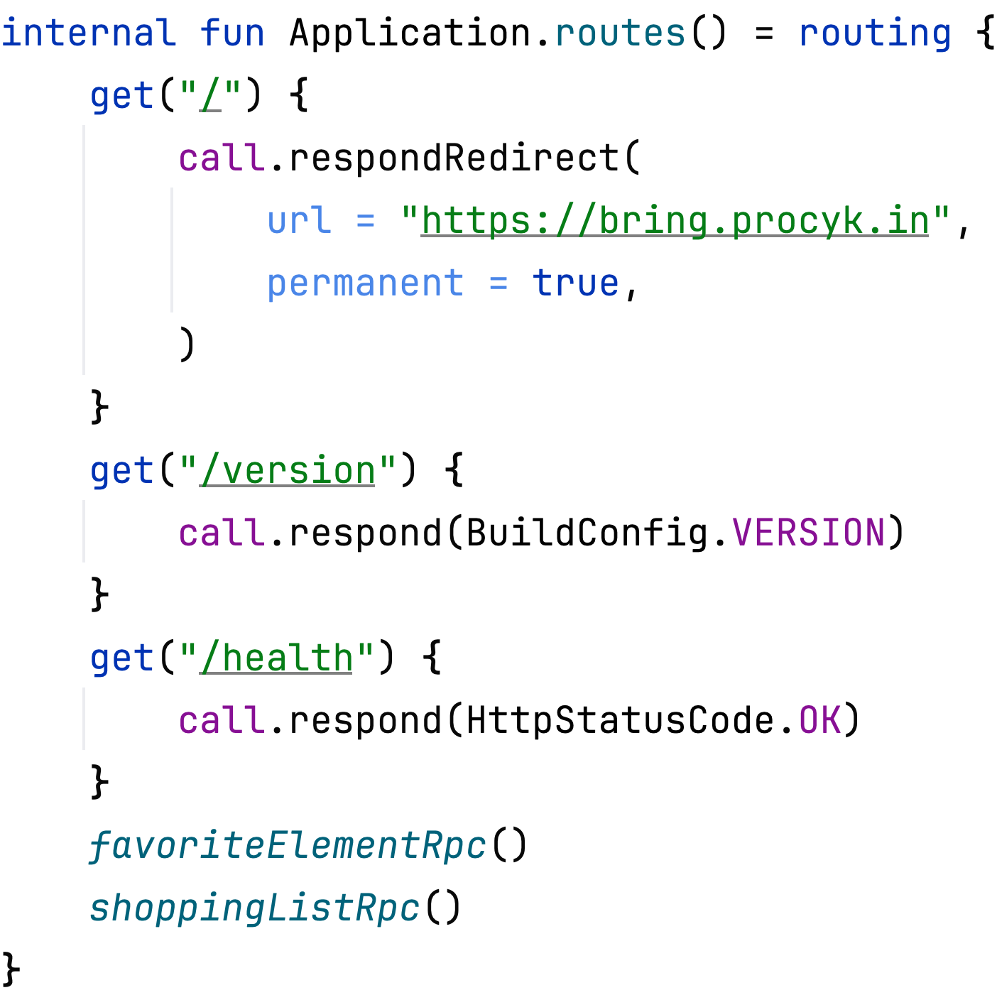

</div>
<div>

- [Ktor](https://ktor.io/docs/welcome.html) framework for building the server
- a huge collection of plugins
- nice integration with `kotlinx-rpc`
- handy DSL for configuring routes
* option to use GraalVM Native Image for native builds with the `CIO` engine (see `graalvmNative { ... }` block in `build.gradle.kts`)

</div>
</div>

---

<!-- scoped style -->
<style scoped>
.columns {
    height: 24em;
}
</style>

<!-- header: '`composeApp`&nbsp;part — shared UI' -->

<div class="columns">
<div class="center">

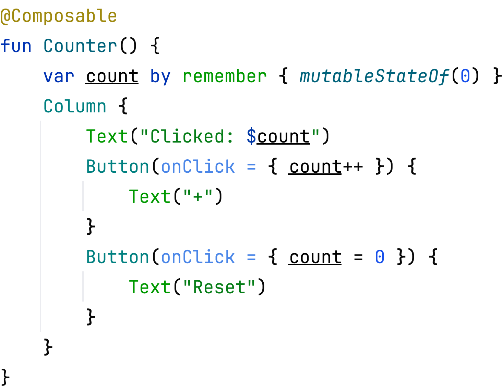

</div>
<div class="center">

* [Compose Multiplatform](https://www.jetbrains.com/help/kotlin-multiplatform-dev/compose-multiplatform-create-first-app.html) for building UI
* building a consistent UI between platforms
* based on Android’s Jetpack Compose, Compose Multiplatform brings it to many platforms
* a declarative UI — everything in one place

</div>
</div>

---

<!-- scoped style -->
<style scoped>
.columns {
    height: 24em;
}
</style>

<!-- header: '`composeApp`&nbsp;part — shared view models' -->

<div class="columns">
<div class="center">

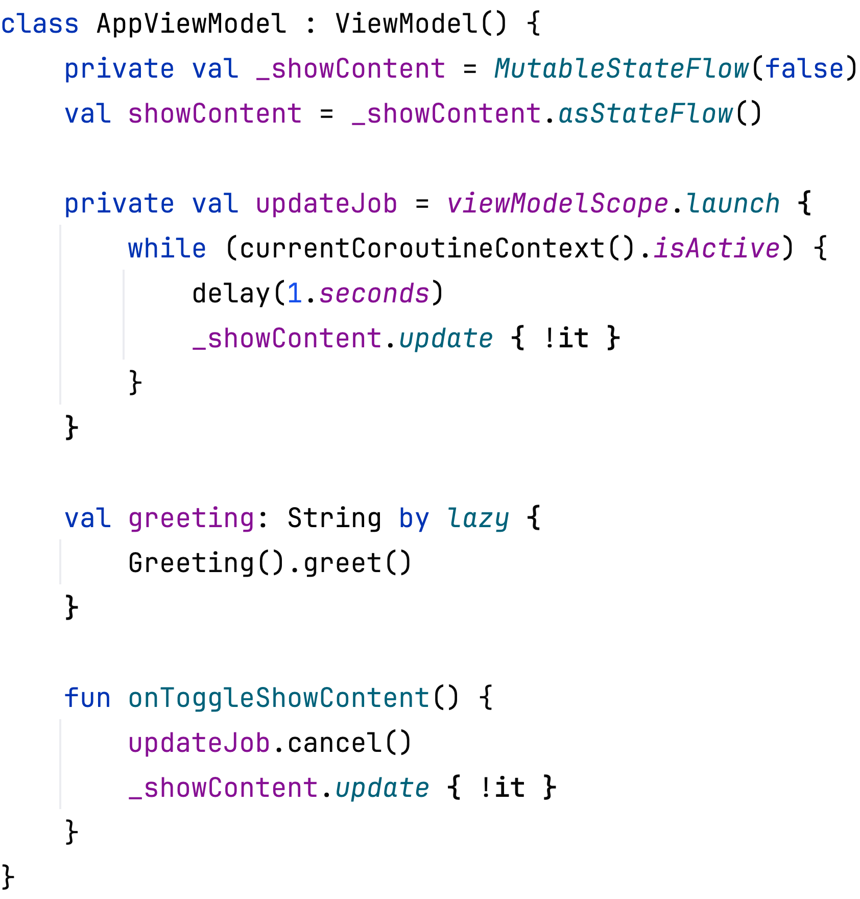

</div>
<div class="center">

* shared view models
* consistent logic between platforms
* well integrated with `kotlinx-coroutines` via `viewModelScope`
* when you need to use them from native code, you might explore [KMP-NativeCoroutines](https://github.com/rickclephas/KMP-NativeCoroutines), [Decompose](https://github.com/arkivanov/Decompose), the experimental [Swift export](https://kotlinlang.org/docs/native-swift-export.html#declarations)

</div>
</div>

---

<!-- header: 'Summary' -->

* Building KMP apps is easy to start and offers a lot of flexibility
* No code duplication thanks to modules and libraries like `shared`
* Well‑scaling results — `composeApp` can be compiled to multiple client targets
* The pleasure of building UI with CMP and CHR
* A consistent UI across platforms, with controllable platform‑specific behavior
* Building the server side with Ktor gives you full control and can be extended with plugins

---

<!-- header: 'Explore more...' -->

- AI model integration with the [Koog](https://docs.koog.ai/) KMP framework
- [Configuration of a Docker](https://github.com/avan1235/bring/blob/master/Dockerfile) image with a natively compiled server
- [GitHub Actions](https://github.com/avan1235/bring/tree/master/.github/workflows) for building and publishing the app
- [Screenshot tests](https://github.com/avan1235/bring/tree/master/composeApp/src/androidUnitTest/kotlin/in/procyk/bring/test) that automatically render the app UI and export it as `.png` files
- [Server integration tests](https://github.com/avan1235/bring/tree/master/server/src/test/kotlin/in/procyk/bring/service) with [Testcontainers](https://testcontainers.com/)

---

<!-- header: '' -->
<!-- footer: '' -->

# Thank you for your attention!

---

<!-- scoped style -->
<style scoped>
.columns {
    grid-template-columns: 1fr 1fr 1fr 1fr;
}
</style>

<!-- header: '' -->
<!-- footer: '' -->

<div class="columns">

<div class="center">


[Slides](https://talks.procyk.in/bring/)

</div>

<div class="center">


[GitHub](https://github.com/avan1235/bring/)

</div>

<div class="center">


[bring.procyk.in](https://bring.procyk.in/)

</div>

<div class="center">


[Google Play](https://play.google.com/store/apps/details?id=in.procyk.bring)

</div>

</div>