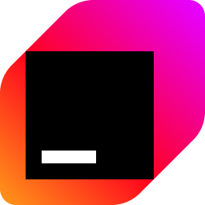

<!-- _class: title -->

# Effective Kotlin Multiplatform Deploying to multiple platforms in 30 minutes

## Maciej Procyk

### Kotlin Multiplatform Tooling

## JetBrains

---

<!-- header: '' -->

# The assumptions

---
<!-- header: 'The goal for this presentation' -->

* build a simple, working app tracking ISS
* make it work on all major platforms: Android, iOS, JVM and web
* DRY and KISS
* have fun writing the code
* show how to start with development of KMP apps, and what are the nice tools to use

---

<!-- header: 'Why choose Kotlin Multiplatform?' -->

* write code once, run it everywhere
* share code between platforms, end with native executables
* migrate the existing codebase to KMP gradually
* option to easily define target-specific behavior

---

<!-- header: '' -->

# (Live) Coding ISS

---

<!-- header: 'Plan' -->

1. play with API
2. HTTP client and model serialization
3. text-based UI and shared view model
4. styled map component with controls

---

<!-- scoped style -->

<!-- header: '' -->
<!-- footer: '' -->

<video id="scrollVideo" muted>
  <source src="./images/demo.mp4" type="video/mp4">
  Your browser does not support the video tag.
</video>

---

<!-- header: 'Summary' -->

* start with working KMP project, extend it to your needs
* results:
  * common, performant UI in shared code
  * model and utils shared between clients and server, and different target platforms
* using KMP libraries makes it easy to add features
* building UI with Compose Hot Reload is fast, and a pleasure

---

<!-- header: 'Explore more...' -->

- book [Kotlin in Action, Second Edition](https://www.manning.com/books/kotlin-in-action-second-edition) to start with Kotlin
- [KMP docs](https://kotlinlang.org/docs/multiplatform.html) with tutorials
- [klibs.io](https://klibs.io) for searching through KMP libraries
- [Bring!](https://github.com/avan1235/bring) — KMP full app sample, with clients and server

---

<!-- header: '' -->
<!-- footer: '' -->

# Thank you for your attention!

---

<!-- scoped style -->

<!-- header: '' -->
<!-- footer: '' -->

[Slides](https://talks.procyk.in/effective-kmp/)

[GitHub ISS](https://github.com/avan1235/iss/)

[GitHub Bring!](https://github.com/avan1235/bring/)

